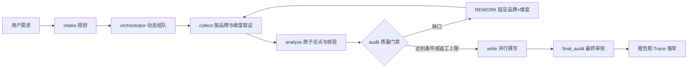

# Trace 与多角色编排：面试讲法

## 一句话定位

Verda 的亮点不只是“多个角色调用大模型”，而是把调研做成**有阶段、有证据交接、有质检返工、可回放的工作流**。`run_pipeline()` 是中央编排器，专家是按技能选用的角色画像；执行任务仍由一个后端流程统一调度。

## 实际代码链路

- **动态组队**：`_dispatch_experts()` 用专家名册和任务信息请 LLM 选出决策、策略、执行角色，并校验专家 ID；失败时使用固定团队（`backend/app/core/orchestrator.py:348–396`）。
- **角色分工**：L3 负责规划和质检，L1 负责采集，L2 负责分析；写作由选定负责人统筹。角色 ID 写入思考流、消息和 Trace，使用户能看到“谁在何阶段做了什么”。
- **数据交接**：`Evidence` 带来源、全文、时间和采集人；`Claim` 带论点、证据 ID、作者和核验状态；`Envelope` 表达生产或返工任务。关键交接是这些结构化对象，不是不同角色的自由聊天记录（`backend/app/core/models.py`）。
- **并行边界**：采集按品牌顺序推进；原子分析在 `ThreadPoolExecutor(max_workers=3)` 中按品牌×维度并发（`orchestrator.py:1036–1058`）；章节写作用 `asyncio.create_task()` 与 `as_completed()` 并发（`orchestrator.py:929–951`）。因此可以说“阶段内有限并行”，不能说所有专家同时自主运行。
- **返工闭环**：规则与 LLM 质检识别缺口，`decide_rework()` 产出指向具体品牌×维度的 `REWORK` 信封。编排器消费信封，补采该格、重分析并复核；已通过格子的论点保留。返工轮数由模式控制，达到上限仍有问题则报告标为待复核（`orchestrator.py:800–909`，`backend/app/core/audit.py:185–201`）。

## Trace 为什么是亮点

`run_pipeline()` 在调用模型前设置 `task_id / agent_id / stage / purpose` 上下文；`asyncio.to_thread()` 和分析线程里的 `copy_context()` 把上下文传到实际 LLM 调用。`llm.chat()` 统一记录模型、Token、耗时、输入输出摘要、决策和证据 ID；搜索与规则动作通过 `record_manual_span()` 补齐。新 span 由 `drain()` 增量进入 SSE，完成时保存到报告和 `traces` 表（`backend/app/core/trace.py`、`llm.py:161`、`orchestrator.py:629–631, 1012–1016`）。

这让面试官能追问并得到具体答案：**某个结论是谁提出的、引用了哪些证据、经过哪轮质检、花了多少模型 Token、为什么返工**。Trace 保存的是截断摘要（通常最多 600 字符），不是完整 Prompt/响应；任务完成后内存缓冲会清理，持久化记录以落库内容为准。

## 30 秒项目介绍

> 我负责的核心是一个多角色调研编排器。用户提出竞品研究问题后，系统动态选取专家角色，按品牌和维度采集证据，再并发生成原子论点并核验来源。质检发现缺口，会发出指向具体品牌和维度的返工任务，补采、重分析、复核后才写报告。每一步都有 Trace，能看到角色、模型调用、耗时、Token 和证据链；SSE 让用户实时观察，断线后还能回放事件。

## 深挖时可以讲的三个问题

1. **为什么需要编排器？** 模型若直接从检索结果写完整报告，很难定位错误和返工。把过程拆为规划、取证、核验、质检、写作，使每阶段都有输入输出和质量门槛。
2. **如何避免“多 Agent”只是换名字？** 角色不仅用于显示：编排会按专家技能选择成员；不同阶段设置负责人，保留 Evidence/Claim/Envelope 交接和审校责任。但这些角色不是 48 个独立进程，也没有独立消息队列，准确说法是“多角色协作的中央编排工作流”。
3. **Trace 如何帮助排障？** 用 `task_id` 串联阶段、专家、模型调用和证据，比较返工前后指标；同时用 SQLite 事件表回放前端过程。若某章引用错误，可从报告论点追到证据与对应 Trace，而不是只看最终文本。

## 不应夸大的边界

- 当前代码是 Python 中央编排器和 SQLite 任务执行，不是 48 个自治 Agent 服务，也不是实际运行的 LangGraph 图。
- `Envelope` 是结构化返工指令与事件载荷，不是跨进程消息总线。
- 断线回放已经实现；进程故障后仍需显式重试，单机运行不具备分布式高可用。
- 并行主要发生在分析和写作阶段，采集不是全量并发。
