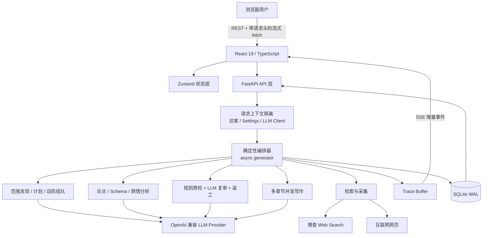
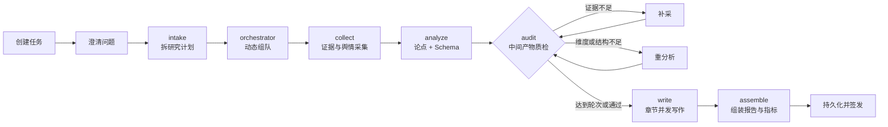

# 青野 Verda：架构链路与面试指南

> 2026-09-23 更新提示：下文保留 2026-09-22 的架构审阅快照。证据选段、Claim 支持性校验、补采重分析和待复核状态已改造；这些点请以 [证据链改造记录](./EVIDENCE_CHAIN_REWORK.md) 为准。

> 更新日期：2026-09-22
>
> 依据：当前工作区代码，而非仅依据 README 或产品演示口径。
>
> 目标：帮助候选人把项目讲清楚、讲出工程含量，同时主动守住不能夸大的边界。

## 1. 先给结论：这个项目到底是什么

青野 Verda 是一个面向竞品研究的、证据驱动的 AI 工作流系统。它不是一个简单的聊天壳，也不是 48 个独立进程互相对话；更准确的定义是：

> 以专家角色画像驱动任务分工，以确定性工作流约束 LLM，以真实检索证据作为公共上下文，再通过规则质检、LLM 复审、返工和 Trace 形成闭环的竞品研究工作台。

系统的核心价值不在于“用了多少个 Agent”，而在于把一个容易失控的生成任务拆成了可观察、可校验、可返工、可持久化的生产链路。

### 30 秒面试口径

我做的是一个证据驱动的多角色竞品研究系统。用户提交主题后，系统先澄清范围并动态选择专家角色，再做多角度联网搜索、正文抓取、相关性过滤和可信度评分；之后基于证据生成论点及功能树、定价模型、用户画像等结构化对象。中间产物会经过规则质检和 LLM 复审，不达标会回到采集或分析阶段返工。最后按章节并发生成报告，并通过 SSE 实时推送进度、证据和 Trace。系统还处理了浏览器自带 API Key、请求级配置隔离、访客数据隔离和 SQLite 并发写等工程问题。

### 2 分钟面试口径

这个项目主要解决三个问题。

第一，普通 LLM 竞品分析很容易“有结论、没证据”。因此我把 Evidence 和 Claim 分开建模，Claim 只能引用本轮真实存在的 evidence ID；高置信结论要求至少两个独立域名。检索侧还做了搜索结果过滤、网页正文二次过滤、来源权威性、时效性和抓取质量评分。

第二，多步骤 AI 任务容易黑盒化。我用一个异步生成器实现确定性流水线，把需求理解、组队、采集、分析、质检、返工、写作、交付拆成显式阶段。每次 LLM 调用和关键规则动作都记录 Trace，并通过 SSE 实时推送给前端。写作阶段按章节并发，核心章和辅助章可以走不同模型档位。

第三，公开部署时不能让访客共享服务端密钥和数据。我增加了浏览器自带 DeepSeek/博查 Key 的模式，利用 `ContextVar` 将配置、LLM Client 和访客数据域绑定到请求上下文；访客资源在 SQLite 中维护所有权映射，并限制单访客和全局并发任务数。这个方案适合当前单机版本，同时我也能明确说明它在多进程、分布式锁、密钥存储和任务恢复方面的升级方向。

---

## 2. 总体架构

### 技术分层

| 层 | 技术与模块 | 主要职责 |
|---|---|---|
| 前端交互 | React、React Router、Zustand、ECharts、ReactFlow | 澄清、工作台、证据流、DAG、Trace、报告和数据图表 |
| 通信 | REST + 基于 `fetch` 的 SSE 解析 | 普通 CRUD 与单向实时事件流 |
| API | FastAPI | 参数校验、访客绑定、任务并发门控、流式响应 |
| 编排 | 自研异步生成器工作流 | 节点推进、角色分配、返工、事件下发 |
| AI | OpenAI 兼容客户端，多模型档位 | 规划、分析、质检和写作 |
| 检索 | 博查、httpx、trafilatura、BeautifulSoup | 搜索、正文抽取、图片抽取和降级 |
| 质量 | 可信度规则、Schema coercion、质量报告 | 引用过滤、覆盖率、交叉验证和返工决策 |
| 状态与数据 | `ContextVar`、SQLite WAL | 请求级配置隔离、资源归属、报告与 Trace 持久化 |
| 部署 | Docker Compose、Caddy、只读容器、volume | 单机生产部署、TLS 入口和数据卷 |

关键入口：

- 后端 API：[main.py](../backend/app/main.py)
- 主编排器：[orchestrator.py](../backend/app/core/orchestrator.py)
- 前端流解析：[api.ts](../frontend/src/lib/api.ts)
- 流状态聚合：[taskStore.ts](../frontend/src/store/taskStore.ts)
- 持久化：[db.py](../backend/app/core/db.py)

---

## 3. 真实端到端链路

README 中常见的展示顺序是 `intake → orchestrator → collect → analyze → write → audit → done`。当前代码的真实执行顺序是：

当前实现是“先审分析中间产物，再写最终正文”，不是“写完全文再终审”。这个设计能减少在低质量证据上浪费写作 token，但也意味着系统目前缺少一次真正针对最终报告正文的终审。

### 3.1 创建任务与需求澄清

1. 前端调用 `POST /api/tasks`，提交主题和 `quick/deep/expert` 模式。
2. 后端检查 LLM 与博查 Key 是否可用。
3. `_discover_scope` 先识别对象、领域和候选竞品。
4. 系统生成竞品、维度、市场、用户、时效和产出视角等澄清项。
5. `POST /api/tasks/{id}/clarify` 将答案写回任务。

值得讲的点：澄清不是固定表单，候选竞品会由 LLM 先做一次范围发现；用户选择又在后续计划阶段拥有更高优先级，避免模型把用户明确指定的对象覆盖掉。

代码证据：[orchestrator.py](../backend/app/core/orchestrator.py) 中的 `create_task`、`_clarify_questions`、`_discover_scope` 和 `_plan_research`。

### 3.2 动态计划与专家选择

规划器输出 `brands`、`focus`、`angles` 和用于同名消歧的 `category`。组队阶段从 48 个专家画像中选择决策层、策略层和执行层，并给出指派原因。之后实际流水线会选出采集者、舆情专家、分析者、质检者和写作者的角色 ID。

必须诚实说明：48 位专家是角色画像和提示上下文，不是 48 个独立常驻模型实例。当前大部分分析结果由少量 LLM 调用统一生成，再把作者或采集者 ID 绑定到产物上。

代码证据：[experts.json](../backend/app/data/experts.json)、[orchestrator.py](../backend/app/core/orchestrator.py) 中的 `_dispatch_experts`。

### 3.3 证据采集链

关键处理：

- 多角度查询逐条执行，单条失败不会中断整次调研；
- 搜索结果按 URL 去重；
- 搜索摘要和抓取正文分别做一次相关性过滤；
- 正文优先用 trafilatura，失败回退到 BeautifulSoup，再失败保留搜索摘要；
- 抽取 OG 图、正文图片和来源链接；
- 可信度根据来源类型、域名权威性、发布时间、时效、抓取质量和互动信号计算。

代码证据：[search.py](../backend/app/core/search.py)、[fetcher.py](../backend/app/core/fetcher.py)、[textquality.py](../backend/app/core/textquality.py)、[credibility.py](../backend/app/core/credibility.py)。

### 3.4 舆情链

系统针对若干主要品牌，在抖音、小红书、B 站、微博和知乎做站内限定搜索；如果限定域名无结果，会退回“品牌 + 平台名 + 评价/体验”等全网搜索。结果经过品牌和品类相关性过滤，再进入情感分类、观点阵营与代表性观点聚类。

必须守住的边界：当前采集的是搜索结果中的标题、摘要和链接，不是登录各平台后抓取完整评论区，也不是平台官方评论 API。因此面试时应说“多平台口碑搜索样本”，不要说“全量社媒评论爬虫”。

代码证据：[sentiment.py](../backend/app/core/sentiment.py)、[orchestrator.py](../backend/app/core/orchestrator.py) 的舆情采集段。

### 3.5 论点与结构化知识链

分析阶段有两类输出：`Claim`，以及功能树、定价模型、用户画像三类结构化知识。

防幻觉手段不只写在 Prompt 中，还做了代码级约束：

- 模型返回的 evidence ID 必须存在于本轮证据集合，否则被过滤；
- Claim 的置信度由有效证据数和独立域名数重新计算，而不是信任模型自报；
- 三类 Schema 经过 coercion，枚举非法值会回退，字段类型会规范化；
- 市场份额超过 100 时按比例归一化。

代码证据：[models.py](../backend/app/core/models.py)、[schemas.py](../backend/app/core/schemas.py)、[orchestrator.py](../backend/app/core/orchestrator.py) 中的 `_analyze`、`_analyze_structured`、`_sanitize_share`。

### 3.6 质检与返工链

质检由两层组成：

- 规则层计算高置信论点占比、重点维度覆盖、各品牌证据数与独立域名数、Schema 完整度；
- LLM 层模拟质检官对中间产物逐维度打分，输出问题和改进建议。

返工是可执行分支：品牌信源不足会生成发往 `collect` 的 `REWORK` Envelope；维度或 Schema 不足会生成发往 `analyze` 的 Envelope，并将质检反馈注入新 Prompt。返工后重新计算指标并做 LLM 复审。快速、深度、专家级模式最多分别返工 0、1、2 次。

代码证据：[audit.py](../backend/app/core/audit.py)、[models.py](../backend/app/core/models.py)、[orchestrator.py](../backend/app/core/orchestrator.py) 的 audit/rework 段。

### 3.7 并发写作链

各章节用 `asyncio.create_task` 创建任务，再用 `asyncio.as_completed` 按完成顺序收集。同步 LLM SDK 调用放进 `asyncio.to_thread`，每完成一章就向前端推送进度。核心章、辅助章和杂务可以路由到不同模型档位；单章失败独立重试，最终失败只降级该章。

真正并行的是章节写作；品牌采集和平台采集目前主要顺序执行。面试时不要泛化成“整个多 Agent 流程全面并发”。

### 3.8 Trace 与实时前端链

每次 LLM 调用会记录模型、Prompt 摘要、输出摘要、token、延迟、Agent、阶段和用途。采集、规则质检等非 LLM 动作也能手工写入 Trace。

`ContextVar` 保存当前任务、Agent 和阶段；`asyncio.to_thread` 会复制上下文，使深层 `chat()` 不需要层层增加 trace 参数。这是一个很适合面试展开的技术点。

后端将节点、思考、证据、图表、进度、Trace 和报告完成事件编码为 SSE。前端没有使用原生 `EventSource`，而是用 `fetch + ReadableStream` 自己解析事件块，因为公开访客模式需要携带 API Key 和 visitor header，而 EventSource 不能自由设置这些请求头。

代码证据：[trace.py](../backend/app/core/trace.py)、[main.py](../backend/app/main.py)、[api.ts](../frontend/src/lib/api.ts)、[taskStore.ts](../frontend/src/store/taskStore.ts)。

### 3.9 持久化与访客隔离链

SQLite 保存任务、报告、证据、Trace、订阅、反馈和专家工作量。连接采用每线程独立连接、WAL 和 `busy_timeout`；写操作再由进程内可重入锁串行化。

公开访客模式下，浏览器生成随机 visitor token；后端再次哈希后作为 owner ID；`visitor_resources` 记录资源归属；请求级 `Settings`、LLM Client 和数据库 visitor context 由 `ContextVar` 隔离。DeepSeek 和博查 Key 只附加到需要它们的请求头。

这是一种匿名工作区隔离，不等于用户认证。只要 visitor token 泄露，对方就能访问该工作区。

代码证据：[visitorIdentity.ts](../frontend/src/lib/visitorIdentity.ts)、[browserCredentials.ts](../frontend/src/lib/browserCredentials.ts)、[client_credentials.py](../backend/app/core/client_credentials.py)、[config.py](../backend/app/core/config.py)、[db.py](../backend/app/core/db.py)。

---

## 4. 最值得讲的亮点

### 亮点一：把“有引用”升级成证据控制面

多数 AI 报告只是在文本尾部拼链接；这里把证据变成贯穿采集、分析、质检、写作、图表和前端回放的核心 ID。模型不能凭空注册证据 ID，Claim 的置信度也由代码重算。

> 面试表达：我没有把防幻觉只寄托在 Prompt 上，而是建立了 Evidence→Claim→Section 的引用链。模型可以生成文字，但不能决定某个不存在的证据是否合法，也不能自己宣布高置信。

### 亮点二：规则质检与 LLM 质检互补

规则擅长稳定判断独立域名数、字段填充率和覆盖率；LLM 擅长发现论证空洞、维度失衡和改进方向。LLM 负责语义层意见，返工方向仍落成可执行的 collect/analyze Envelope。

### 亮点三：请求级 AI 配置隔离

多访客 BYOK 模式最危险的问题不是页面能否填 Key，而是异步任务、线程池和 SDK Client 会不会串 Key。当前用访客 owner、请求 Settings、请求 LLM Client 三层上下文隔离，并有 async/thread 并发测试覆盖。

### 亮点四：为实时可观测而设计的数据协议

编排器本身就是 `AsyncIterator[Event]`，业务执行与流式展示统一。前端无需轮询即可显示 DAG、证据、返工和 Trace；同一批 Trace 最后进入数据库与报告回放。

### 亮点五：并发放在收益最大的阶段

章节写作依赖弱，适合并发；质检和分析有强依赖，保持顺序更容易保证状态一致。当前不是盲目追求全并发，而是把并发放在可隔离、token 消耗大的写作阶段。

### 亮点六：降级策略围绕“不编造”设计

搜索单条失败、网页抓取失败、正文提取失败、单章写作失败都有局部降级；但如果一条有效证据都没有，主流程直接报错，不生成伪报告。

### 亮点七：单机部署有实际生产约束

Compose 使用只读后端容器、独立数据卷、tmpfs、`no-new-privileges`、健康检查、日志轮转和 Caddy 入口。它还不是完整云原生架构，但已经考虑长期运行而不只是本地演示。

---

## 5. 真正的难点

### 难点一：检索召回率、相关性和来源质量的权衡

过滤过严会漏掉有效资料，过松会带入同名对象、营销软文和无关页面。当前用搜索摘要过滤、正文二次过滤、品类消歧、域名规则和抓取质量评分分层处理。更进一步应引入 reranker、语义相似度和来源白名单版本化。

### 难点二：LLM 非确定性与结构化契约

Prompt 要求 JSON 不代表输出永远合法。项目通过 JSON 提取、Schema coercion、枚举回退、非法 evidence ID 过滤、数值归一化和单章重试把输出收敛为稳定契约。难点是既要容错，又不能把错误悄悄修成看似合理的数据。

### 难点三：异步流、线程池和上下文传播

主链是 async，OpenAI 客户端和抓取逻辑是同步调用，因此使用 `to_thread`。随之出现 Trace、访客配置和 LLM Client 如何跨线程传播的问题；`ContextVar + to_thread copy_context` 是当前解法。

### 难点四：带自定义请求头的 SSE

EventSource 不能设置访客凭据头。改用流式 fetch 后，需要自己处理 chunk 边界、多行 data、JSON 解析、AbortController、提前断流和完成状态。

### 难点五：质量指标不能自欺欺人

高置信比例不等于事实准确率，效率倍数依赖人工耗时基线，覆盖更多域名也不代表来源更可靠。真正验证准确率需要人工标注集、引用蕴含评测和回归基准。

### 难点六：单机状态与未来分布式的边界

当前并发计数、活跃任务集合、Trace buffer、写锁都在单进程内。多 worker 或多副本时需要把任务状态、锁、事件流和队列迁到 Redis、PostgreSQL 或专门的工作流系统。

---

## 6. 面试时必须主动说明的边界

| 容易说过头的表述 | 代码事实 | 推荐说法 |
|---|---|---|
| “48 个 Agent 并发协作” | 48 个角色画像；实际由少量阶段调用和章节任务执行 | “48 个可选专家画像驱动动态组队，执行层是角色化工作流，章节写作并发” |
| “基于 LangGraph 编排” | 依赖中有 LangGraph，但主流程是自研 async generator，没有构建 StateGraph | “采用 LangGraph 风格的显式节点与返工边，自研轻量编排器” |
| “所有 Prompt/输出完整落库” | 内存、DB 和报告中都有长度裁剪 | “关键调用的 Prompt/输出摘要、token、耗时和引用落 Trace” |
| “审计最终报告” | audit 在 write 之前，审的是证据、Claim 和 Schema | “先做研究中间产物质量门禁；最终正文审校是下一步补强项” |
| “二次深化调研” | `refine_section` 只使用已有证据重写，没有重新联网 | “基于批注和已有证据深化章节；真正增量检索尚未接入” |
| “抓取五大平台真实评论” | 主要是平台定向搜索结果摘要与链接 | “采集可溯源的多平台口碑搜索样本” |
| “准确率” | 指标实际是高置信 Claim 占比 | “内部置信度代理指标，不是与人工金标对比后的准确率” |
| “全面异步并发” | 章节写作并发，品牌与平台采集主要串行 | “写作阶段并发；采集当前为有界顺序执行” |
| “多租户认证” | 随机 visitor token 做匿名隔离，无账号和权限系统 | “匿名浏览器工作区隔离，不等同于正式身份认证” |

主动讲清这些边界不会减分，反而能证明你理解实现，而不是背产品文案。

---

## 7. 面试官高概率拷打问题与回答

### Q1：这为什么算多 Agent，不就是多次调用一个模型吗？

建议回答：

> 从运行时实例看，它不是 48 个自治进程，而是角色化多 Agent 工作流。Agent 的差异体现在角色画像、阶段职责、产物所有权、消息 Envelope 和 Trace 身份上。编排器决定谁负责采集、分析、质检和写作。当前真正并行的是章节任务。如果要求严格的自治 Agent，我会把每个角色升级为独立状态节点、独立上下文和工具权限，而不是声称当前已经做到了。

追问准备：解释 `_dispatch_experts`、`Envelope`、`author/collected_by` 和 Trace 的 Agent ID。

### Q2：为什么不用 LangGraph，依赖里不是已经有了吗？

建议回答：

> 当前状态图较固定，最重要的产品要求是把每个中间事件实时吐给前端，所以我用 async generator 同时承担编排和事件源，开发成本更低。代价是检查点、恢复、持久状态迁移和分布式执行都要自己做。流程继续复杂化后，我会迁到 LangGraph StateGraph 或 Temporal，而不是继续扩大单个 1800 行编排文件。

### Q3：怎么证明模型引用的证据真的支持结论？

建议回答：

> 当前只能证明“引用 ID 存在”和“多域交叉”，还不能严格证明语义蕴含。下一步会把 Claim 拆成原子命题，对每个 Claim-Evidence 对跑 NLI/LLM judge 并抽取支持句；数字型结论再做值、单位、时间三元组校验。只有这些通过后，才更接近真正的 citation correctness。

### Q4：两个独立域名就一定高置信吗？

建议回答：

> 不一定。两个域名可能转载同一原始稿，也可能都引用错误信息。当前独立域名只是低成本代理。生产升级应引入来源血缘、转载聚类、原始来源优先级，以及“官方事实”和“用户观点”不同的评分模型。

### Q5：规则质检已经有了，为什么还要 LLM 质检？

建议回答：

> 规则适合客观、可重复的门槛，如域名数和 Schema 填充；它不擅长判断结论是否空泛、论证是否跳步。LLM 复审补语义判断，但 LLM 结论不能成为唯一门禁，所以返工目标仍结构化为 collect/analyze 两类动作。

### Q6：为什么审计放在写作前？

建议回答：

> 当前把 audit 当作 research artifact gate，先保证证据、Claim 和 Schema 达标，再消耗大量 token 写全文，成本更可控。但这不能替代最终稿审校。更完整的版本应有两道门：写作前研究质检，写作后检查事实一致性、引用落点、章节重复和语气。

### Q7：SSE 为什么不用 WebSocket？

建议回答：

> 这个场景主要是服务端单向推送，SSE 的语义和代理兼容性更简单；用户输入仍走 REST。公开模式需要自定义凭据 header，所以前端使用 fetch stream 而不是 EventSource。若未来需要运行中暂停、人工批准、动态加工具等强双向交互，再考虑 WebSocket。

### Q8：断线后能恢复吗？

建议回答：

> 当前不能精确续传。连接断开后生成器会结束，任务中间状态没有持久化检查点；同一任务也禁止重复流式执行。这是生产化缺口。升级方案是把任务交给后台 worker，事件写入带序号的 Redis Stream/Kafka，客户端用 last event ID 恢复，SSE 只做订阅层。

### Q9：为什么用 SQLite，能扛多少并发？

建议回答：

> 当前定位是单机、低并发研究工具，SQLite 运维成本低。通过 WAL、每线程连接、busy timeout 和进程内写锁解决读写冲突。但它不适合横向扩展和大量长事务；多副本版本应迁 PostgreSQL，任务与事件状态放 Redis 或消息队列。

### Q10：并发限制可靠吗？

建议回答：

> 单进程内可靠，当前全局最多两个流任务，且同一访客只能跑一个。但计数器和集合是内存状态，多 worker 下并不可靠。生产多实例需要 Redis 分布式信号量和带 TTL 的任务锁，并处理进程崩溃后的租约释放。

### Q11：多访客会不会串 API Key？

建议回答：

> 访客 Key 被构造成请求级 Settings，LLM Client 也是请求级；二者用 ContextVar 绑定，并用上下文管理器在请求结束后恢复或关闭。`to_thread` 会复制 context，测试覆盖了 async 与线程混合并发。但进程级全局对象仍需审计，例如 token 计数目前就是全局累计，跨并发任务的差值可能不精确。

### Q12：把 API Key 放 localStorage 安全吗？

建议回答：

> 它避免服务端持久化用户 Key，但会暴露在 XSS、恶意浏览器扩展和本机共享账号风险下。必须强制 HTTPS、严格 CSP、禁第三方脚本、日志和反向代理头部脱敏。更高安全级别可改用 sessionStorage 或内存，并由后端加密短期托管；不能把 localStorage 说成绝对安全。

### Q13：visitor token 为什么还要再哈希？

建议回答：

> 防止数据库直接保存可用于请求的原始 bearer token，数据库泄露时降低直接重放风险。但它没有登录、过期、轮换和撤销机制，因此只是匿名所有权隔离，不是完整认证系统。

### Q14：为什么不用原生 EventSource？

建议回答：

> EventSource API 不能自由携带自定义认证头，而 BYOK 流需要同时传 visitor、LLM Key 和搜索 Key。fetch stream 支持 header 和 AbortController，所以我自己解析 SSE framing。

### Q15：写作并发会不会打爆模型限流？

建议回答：

> 有风险。当前按章节一次性建 task，主要依赖 Provider 限流与单任务章节上限，缺少显式 semaphore 和 429 指数退避。生产化应按 Provider/模型建立独立并发池、速率桶和带抖动重试，并记录每章成本。

### Q16：“效率提升多少倍”可靠吗？

建议回答：

> 它基于“品牌数×维度数×每信息源 8 分钟”的透明经验基线，只适合运营观察，不能作为严格实验结论。真正对外宣称前，需要同一任务下的人工作业对照、样本量、置信区间和质量等价前提。

### Q17：为什么报告整份 JSON 存一列，还另外存 evidence 和 trace？

建议回答：

> 整体 JSON 便于报告一次读取和前端零额外请求，独立表便于全局证据检索、Trace 查询和统计。这是读性能优先的适度反范式化。代价是重复、版本迁移和一致性维护，后续要加 report schema version 和事务边界。

### Q18：`backend` 和 `api` 两份代码为什么重复？

建议回答：

> `backend` 是本地/Docker 主目录，`api` 是 Vercel 约定下的镜像。当前两边核心文件哈希一致，但人工双写是维护风险。更好的做法是抽成单一 Python package，让两个入口共同 import，并在 CI 加一致性检查，最终只保留一份业务代码。

### Q19：目前测试够吗？

建议回答：

> 不够。当前最扎实的是 5 个访客凭据和并发隔离测试；前端能通过 lint 和生产构建。但缺少检索过滤、可信度、Schema coercion、返工分支、SSE 契约、数据库迁移和端到端离线回放测试。下一步应使用录制的搜索/LLM fixture 构建确定性 pipeline regression suite。

### Q20：如果优先重构一个地方，你选哪里？

建议回答：

> 我会先把单文件编排器拆成 typed state + node 接口，并把任务执行从 SSE 请求生命周期中移到后台 worker。这样能同时解决断线恢复、测试隔离、节点重试、分布式执行和 1800 行文件可维护性问题，收益最大。

---

## 8. 当前代码的薄弱点与改进优先级

### P0：决定系统可信度和可恢复性

1. 增加最终报告审计，不只审中间产物；检查正文引用存在性、语义蕴含、数字一致性和章节冲突。
2. 将任务执行脱离 SSE 连接，增加任务状态机、检查点、幂等重试、取消和断线恢复。
3. 将进程内并发门控迁到分布式锁/队列；否则多 worker 会突破上限并重复执行。
4. 把全局 `TOKEN_USAGE` 改为任务级 ContextVar 或 trace 聚合，否则并发任务的 token 差值会互相干扰。
5. 为 LLM 和搜索调用增加统一超时、错误分类、指数退避、限流 semaphore 和熔断指标。

### P1：决定报告质量

1. 增加 Claim-Evidence 语义蕴含校验，而不是只验证 ID 和域名数。
2. 识别转载关系和共同原始来源，避免“伪交叉验证”。
3. 收紧维度覆盖算法。当前只要存在任意有效字段，就可能兜底判定多个 focus 已覆盖，指标偏乐观。
4. `refine_section` 接入真正的增量检索、差异合并和新证据入库。
5. 舆情接入合法的平台 API 或授权数据源，区分“搜索摘要”和“原始评论”。

### P2：决定工程可维护性和体验

1. 拆分 1800 行 `orchestrator.py`，为节点定义输入输出协议和单元测试。
2. 消除 `backend/app` 与 `api/app` 的业务代码复制。
3. 为报告 JSON 增加 schema version 和迁移器。
4. 前端生产包当前主 JS 约 1.7 MB，gzip 后约 567 KB；应对 ECharts、D3、ReactFlow 和页面做动态加载与代码分包。
5. 不要广泛吞掉 `Exception`；需要保留错误类型、traceback、降级原因和可观测指标。

---

## 9. 可以写进简历的项目点

以下表述与当前代码基本一致：

- 设计并实现证据驱动的 AI 竞品研究工作流，将范围澄清、动态角色分配、联网采集、结构化分析、质检返工和报告生成拆分为可观测阶段。
- 建立 Evidence→Claim→Report 引用链，使用有效证据 ID 白名单、独立域名交叉验证、来源/时效/抓取质量评分和 Schema coercion 降低模型幻觉。
- 基于 FastAPI StreamingResponse 与浏览器 Fetch Streams 实现带自定义凭据头的 SSE 工作台，实时展示任务 DAG、证据、返工、token 和 Trace。
- 使用 `asyncio.to_thread + ContextVar` 在异步编排、同步 SDK 和线程池之间传播任务、访客及 Trace 上下文，并完成并发访客凭据隔离测试。
- 使用章节级并发与模型分层路由降低长报告生成耗时，支持快速、深度、专家级三档成本/质量策略。
- 基于 SQLite WAL、每线程连接、资源 owner 映射和进程内写锁实现单机多访客数据隔离与持久化。
- 完成 Docker Compose/Caddy 部署，采用只读容器、健康检查、日志轮转、数据卷和浏览器 BYOK 模式支持公开体验。

不要写：

- “实现 48 个自治智能体的分布式并发协作”；
- “实现全平台评论爬虫”；
- “保证结论 100% 准确”；
- “基于 LangGraph 完成工作流”；
- “完整多租户认证系统”。

---

## 10. 一个可直接使用的 STAR 故事

**Situation**：普通 LLM 竞品报告存在引用不可追溯、生成过程黑盒、失败后只能整单重跑的问题；公开部署后还出现不同访客自带 Key 和数据隔离的要求。

**Task**：设计一条能真实联网、生成结构化报告、允许质量返工、实时展示过程，并能在单机公开部署下避免访客串 Key/串数据的研究链路。

**Action**：

1. 把流程拆成规划、采集、分析、质检、返工、写作和交付节点；
2. 建立 Evidence、Claim、Envelope、TraceSpan 等领域模型；
3. 对模型输出做有效 ID 过滤、Schema coercion 和规则重算；
4. 用规则质检决定返工方向，用 LLM 复审补充语义意见；
5. 用 async generator 输出统一事件协议，前端用 fetch stream 实时消费；
6. 用 ContextVar 隔离请求级 Settings、LLM Client 和 visitor owner，并补充并发测试；
7. 用 WAL、线程连接和写锁约束 SQLite 并发。

**Result**：形成了一条可演示、可追踪、可落库的完整研究链；当前安全隔离测试 5/5 通过，Python 编译检查、前端 lint 和生产构建通过。同时识别出最终报告审计、断点恢复、语义蕴含校验和分布式任务状态仍是下一阶段重点。

---

## 11. 当前验证结果

本次梳理期间实际执行：

| 检查 | 结果 |
|---|---|
| 后端 `unittest` | 5 个测试全部通过，集中覆盖浏览器 Key、请求隔离和访客资源隔离 |
| Python `compileall` | 通过 |
| 前端 ESLint | 通过 |
| 前端 TypeScript + Vite production build | 通过 |
| 构建告警 | 主 JS chunk 约 1.7 MB，存在代码分包优化空间 |
| `backend/app/core` 与 `api/app/core` 哈希比对 | 当前一致 |

测试文件：[test_client_credentials.py](../backend/tests/test_client_credentials.py)。

---

## 12. 最后记住三句话

1. **主线不是“48 个 Agent”，而是“证据驱动、可返工、可观测的 AI 工作流”。**
2. **最强亮点是代码级约束和请求级隔离，不是 Prompt 写得长。**
3. **主动说明当前边界：角色画像不等于自治 Agent，独立域名不等于事实正确，中间产物审计不等于最终报告审计。**
